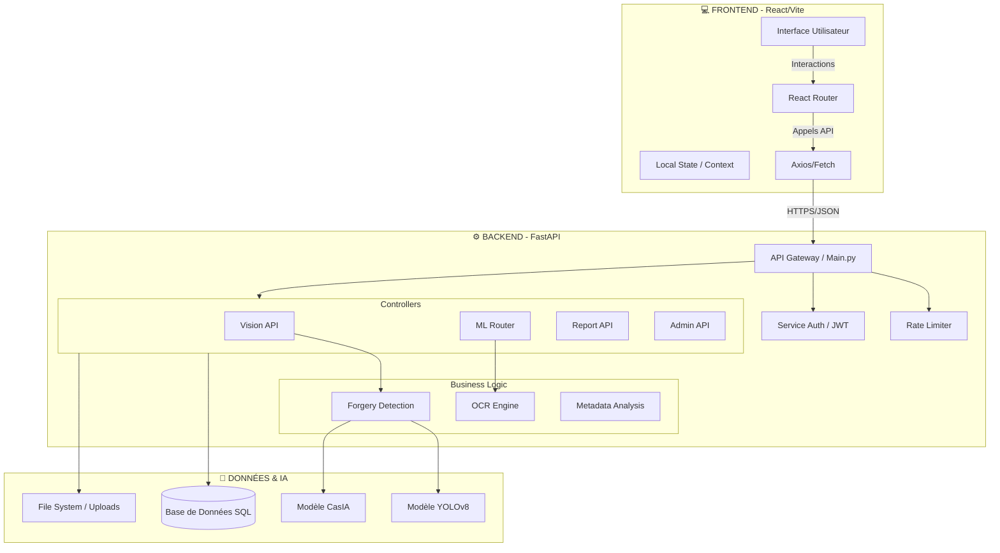

# 🏗️ AUDIT GÉNÉRAL & ARCHITECTURE - VERIFDOC
*Généré le 06 Janvier 2026 - Rapport Technique*

## 1. 📊 État de Santé du Projet
**Score Global : A-**
Le projet est dans un état très avancé (MVP+). La séparation Frontend/Backend est propre et les technologies utilisées sont modernes et performantes.

### 🟢 Frontend (Client)
*   **Techno** : React 18 + Vite + TypeScript.
*   **Style** : Tailwind CSS + Framer Motion (Animations).
*   **État** :
    *   ✅ Interface moderne ("Premium", "Dark Mode").
    *   ✅ Composants réactifs (UploadSimulator, Dashboard).
    *   ✅ Routing géré.
    *   ⚠️ **Point de vigilance** : Quelques warnings SonarQube (liens dépréciés, nesting profond) à nettoyer avant la mise en prod.

### 🟢 Backend (Serveur)
*   **Techno** : Python 3.10+ + FastAPI.
*   **Data** : SQLite (Dev) / PostgreSQL (Prod via SQLAlchemy).
*   **IA/ML** : Modules Vision (OpenCV, Torch) intégrés via des routeurs dédiés (`vision_api`, `ml_router`).
*   **État** :
    *   ✅ Structure API claire (`backend/app`, `backend/api`).
    *   ✅ Sécurité (CORS, Rate Limiting).
    *   ✅ Documentation auto (Swagger UI).
    *   ⚠️ **Point de vigilance** : La gestion des dépendances lourdes (Torch) peut compliquer le déploiement sur des serveurs légers (Render free tier).

---

## 2. 🏛️ Architecture Technique
Voici le schéma complet de votre application telle qu'elle est construite aujourd'hui.

---

## 3. 🚀 Plan de Déploiement (Mise en Ligne)

Pour mettre ce système en ligne ("Live"), voici la procédure standard recommandée :

### Étape A : Backend (Le Cerveau)
1.  **Hébergeur** : Render (recommandé pour Python/FastAPI) ou Railway.
2.  **Config** : Utiliser le `Dockerfile` présent dans `backend/`.
3.  **Env Vars** : Configurer `SECRET_KEY`, `DATABASE_URL` (si PostgreSQL).
4.  **Commande** : `uvicorn backend.app.main:app --host 0.0.0.0 --port 10000`.

### Étape B : Frontend (Le Visage)
1.  **Hébergeur** : Vercel ou Netlify (Gratuit et ultra-rapide pour React).
2.  **Build** : Commande `npm run build`.
3.  **Config** : Définir la variable d'environnement `VITE_API_URL` pointant vers l'URL du Backend (ex: `https://api.verifdoc.io`).
4.  **Déploiement** : Git Push sur la branche `main` connectée à Vercel.

---

## 4. 🔧 Plan de Maintenance (Autonomie)

Pour maintenir le projet sans assistance continue :

1.  **Surveillance des Logs** :
    *   Vérifiez régulièrement les logs du backend (sur Render/Railway) pour voir si des erreurs 500 apparaissent.
2.  **Mise à jour des Modèles IA** :
    *   Si vous ré-entraînez YOLO ou CasIA, remplacez simplement les fichiers `.pt` ou `.h5` dans le dossier `backend/ml/models/`.
3.  **Backup Base de Données** :
    *   En prod, configurez des backups automatiques quotidiens de PostgreSQL.
4.  **Nettoyage** :
    *   Videz le dossier `uploads/` ou configurez un script (Cron) pour supprimer les fichiers vieux de >24h (RGPD).

---

### 📝 Conclusion de l'Audit
Le projet **VerifDoc** est solide. L'architecture est modulaire, ce qui signifie que vous pouvez améliorer le Frontend sans casser le Backend, et vice-versa.
Le simulateur que nous venons de finaliser est un excellent atout marketing ("Growth Hacking") qui tourne entièrement côté client pour l'instant (mock), ce qui est parfait pour la performance de la Landing Page.

**Prochaine étape conseillée** : Lancer le déploiement sur une instance de test (Staging) pour valider la communication Front-Back en conditions réelles.
